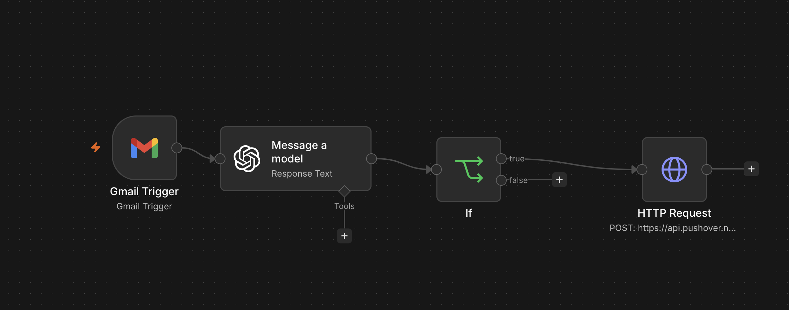

# AI Job Offer Agent

AI-powered workflow that monitors Gmail, classifies recruiting emails using OpenAI, and sends a mobile notification when a paid job offer is detected.

## Workflow

## Overview

The AI Job Offer Agent automates the process of monitoring recruiting emails.

Instead of manually checking an inbox for important employment updates, the workflow uses AI to classify incoming emails and determine whether they contain a paid job offer.

## How It Works

1. **Gmail Trigger** detects a new email.
2. **OpenAI** analyzes the email and classifies it.
3. **IF Node** checks whether the classification is `Paid Offer`.
4. **HTTP Request** sends a notification through Pushover when the condition is true.

## Email Classifications

The AI can classify emails as:

* Paid Offer
* Interview
* Assessment
* Recruiter Follow-up
* Rejection
* Other

Currently, the automated notification is triggered for **Paid Offer** emails.

## Technologies

* n8n
* OpenAI API
* Gmail
* Pushover API
* REST APIs
* JSON
* Workflow Automation

## Skills Demonstrated

* AI workflow automation
* Prompt engineering
* API integration
* Conditional logic
* Business process automation
* Requirements and workflow design
* Event-driven automation

## Security

The public workflow contains placeholder credentials.

Real API tokens, OAuth credentials, and personal authentication information should never be committed to a public repository.

## Workflow File

The sanitized n8n workflow is included in:

`AI_Job_Offer_Agent_GitHub_Safe.json`

Users must configure their own Gmail, OpenAI, and Pushover credentials after importing the workflow into n8n.

## Future Improvements

* Interview notifications
* Assessment notifications
* Recruiter follow-up alerts
* Company name extraction
* Salary extraction
* Google Calendar integration
* Application tracking
* Job-search analytics

